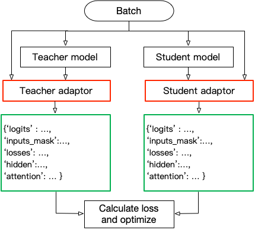

# API

This is the full API documentation of TextBrewer. 
Meanwhile, we are working on moving to readthedoc.

<!-- TOC -->

- [API](#api)
    - [Core Concepts](#core-concepts)
        - [Variables](#variables)
        - [Config and Distiller](#config-and-distiller)
        - [User-Defined Functions](#user-defined-functions)
    - [Classes and functions](#classes-and-functions)
        - [Configurations](#configurations)
        - [Distillers](#distillers)
        - [utils](#utils)
        - [data_utils](#data_utils)
    - [Presets](#presets)
        - [Customization](#customization)
        - [Intermediate Loss](#intermediate-loss)

<!-- /TOC -->


## Core Concepts

### Variables

* **Model_T**: an instance of `torch.nn.Module`, the teacher model, which usually has more parameters than the student model.

* **Model_S**: an instance of `torch.nn.Module`, the student model, usually smaller than the teacher model for the purpose of model compression and faster inference speed.

* **optimizer**: instance of `torch.optim.Optimizer`.

* **scheduler**: instance of `torch.optim.lr_scheduler`, allows flexible adjustment of learning rate.

* **dataloader**: data iterator, used to generate data batches. A batch can be a tuple or a dict.
t
```python
  for batch in dataloader:
    # if batch_postprocessor is not None:
    batch = batch_postprocessor(batch)
    # check batch datatype
    # passes batch to the model and adaptors
```

**Note:**
1. During training, the distiller will check if the batch is a dict, if so the model will be called as model(\*\*batch, \*\*args), otherwise the model is called as model(\*batch, \*\*args). Hence if the batch is not a dict, **users should make sure that the order of each element in the batch is the same as the order of the arguments of model.forward**. `args` is used for passing additional parameters.
2. Users can define a `batch_postprocessor` function to post-process batches if needed. `batch_postprocessor` should take a batch and return a batch. See the explanation on `train` method of [Distillers](#Distillers) for more details.


### Config and Distiller

#### Configurations

* **TrainingConfig**: configuration related to general deep learning model training.
* **DistillationConfig**: configuration related to distillation methods.

#### Distillers

Distillers are in charge of conducting the actual experiments. The following distillers are available:

* `BasicDistiller`: **single-teacher single-task** distillation, provides basic distillation strategies.
* `GeneralDistiller` (Recommended): **single-teacher single-task** distillation, supports intermediate features matching. **Recommended most of the time**.
* `MultiTeacherDistiller`: **multi-teacher** distillation, which distills multiple teacher models ( of the same task) into a single student. **This class doesn't support Intermediate features matching.**
* `MultiTaskDistiller`: **multi-task** distillation, which distills multiple teacher models (of different tasks) into a single student. **This class doesn't support Intermediate features matching.**
* `BasicTrainer`: Supervised training a single model on a labeled dataset, not for distillation. **It can be used to train a teacher model**.

### User-Defined Functions

In TextBrewer, there are two functions that should be implemented by users: **callback** and **adaptor**. 

####  **Callback** 

Optional, can be None. At each checkpoint, after saving the model, the distiller calls the callback function with arguments `model=model_S, step=global_step`. Callback can be used to evaluate the performance of the student model at each checkpoint.
**If users want to do an evaluation in the callback, remember to add model.eval() in the callback**.

The signature is 

```python
callback(model: torch.nn.Module, step: int) -> Any
```


#### Adaptor
It converts the model inputs and outputs to the specified format so that it could be recognized by the distiller, and distillation loss can be computed. At each training step, batch and model outputs will be passed to the adaptor; adaptor reorganize the data and returns a dict.

```python
adaptor(batch: Union[Dict,Tuple], model_outputs: Tuple) -> Dict
```

The functionality of the adaptor is shown in the figure below:



The available keys and their values of the returned dict are:

* '**logits**' :  `List[torch.Tensor]` or `torch.Tensor` : 

  The inputs to the final softmax. Each tensor should have the shape (batch_size, num_labels) or (batch_size, length, num_labels).

* '**logits_mask**': `List[torch.Tensor]` or `torch.Tensor`: 

  0/1 matrix, which masks logits at specified positions. The positions where mask==0 won't be included in the calculation of loss on logits. Each tensor should have the shape (batch_size, length).

* '**labels**': `List[torch.Tensor]` or `torch.Tensor`:

  Ground-truth labels of the examples. Each tensor should have the shape (batch_size,) or (batch_size, length).

  **Note**:

  * **logits_mask** only works for logits with shape (batch_size, length, num_labels). It's used to mask in the length dimension, commonly used in sequence labeling tasks.

  * **logits**, **logits_mask** and **labels** should either all be lists of tensors, or all be tensors.

* '**losses**' :  `List[torch.Tensor]` : 

  It stores pre-computed losses, for example, the cross-entropy between logits and ground-truth labels. All the losses stored here would be summed and weighted by `hard_label_weight` and added to the total loss. Each tensor in the list should be a scalar, i.e., shape [].

* '**attention**': `List[torch.Tensor]` :

  List of attention matrices, used to compute intermediate feature matching. Each tensor should have the shape (batch_size, num_heads, length, length) or (batch_size, length, length), depending on what attention loss is used. Details about various loss functions can be found at [Intermediate Loss](#intermediate-loss).

* '**hidden**': `List[torch.Tensor]` :

  List of hidden states used to compute intermediate feature matching. Each tensor should have the shape (batch_size, length, hidden_dim).

* '**inputs_mask**' : `torch.Tensor` :

  0/1 matrix, performs masking on 'attention' and 'hidden', should have the shape (batch_size, length).

These keys are all **optional**:

* If there is no **'inputs_mask'** or **'logits_mask'**, then it's considered as no masking, or equivalent to using a mask with all elements equal to 1.
* If not using intermediate feature matching, you can ignore **'attention'** and **'hidden'**.
* If you don't want to add loss of the original hard labels, you can set `hard_label_weight=0`, and ignore **'losses'**.
* If **'logits'** is not provided, the KD loss of the logits will be omitted.
* **'labels'** is required if and only if  `probability_shift==True`.
* You shouldn't ignore all the keys, otherwise the training won't start :)

**Usually 'logits' should be provided, unless you are doing multi-stage training.**


## Classes and functions

### Configurations

class **textbrewer.TrainingConfig** (**gradient_accumulation_steps** = 1, **ckpt_frequency** = 1, **ckpt_epoch_frequency**=1, **ckpt_steps** = None, **log_dir** = None, **output_dir** = './saved_models', **device** = 'cuda')

* **gradient_accumulation_steps** (`int`) : accumulates gradients from several steps before doing optimization to save GPU memory consumption. It calls optimizer.step() every **gradient_accumulation_steps** number of backward steps. When it's set larger than 1, it will help reduce GPU memory consumption especially when the batch size is big.
* **ckpt_frequency** (`int`): The frequency of storing model weights, i.e. the number of times to store the model weights for each epoch.
* **ckpt_epoch_frequency** (`int`): stores model after how many epochs each time. For example:
  * **ckpt_frequency**=1, **ckpt_epoch_frequency**=1 : stores once at the end of each epoch (Default).
  * **ckpt_frequency**=2, **ckpt_epoch_frequency**=1 : stores twice (at the middle and at the end) at each epoch.
  * **ckpt_frequency**=1, **ckpt_epoch_frequency**=2 : stores once every two epochs.
* **ckpt_steps** (`int`) :  if `num_steps` in `distiller.train` is set, saves the model every **ckpt_steps**, meanwhile  `ckpt_frequency` and `ckpt_epoch_frequency` will be ignored.
* **log_dir** (`str`) : directory to save the tensorboard log file. Set it to None to disable tensorboard.
* **output_dir** (`str`) : directory to save trained model weights.
* **device** (str, torch.device) : training on CPU or GPU.

**Example**

```python
# usually just need to set the log_dir and output_dir and leave others default
train_config = TrainingConfig(log_dir=my_log_dir, output_dir=my_output_dir)
```

* (classmethod) **TrainingConfig.from_json_file**(json_file : `str`)
  * reads configuration from a json file.

* (classmethod) **TrainingConfig.from_dict**(dict_object : `Dict`)
  * reads configuration from a dict.

class **textbrewer.DistillationConfig** (**temperature** = 4, **temperature_scheduler**='none', **hard_label_weight** = 0, **hard_label_weight_scheduler**='none', **kd_loss_type** = 'ce', **kd_loss_weight**=1, **kd_loss_weight_scheduler**='none', **probability_shift**=False, **intermediate_matches** = None)

* **temperature** (`float`) :temperature for distillation. When computing loss of logits, teacher and student models' logits will be divided by the temperature.
* **temperature_scheduler** (`str`): Dynamically adjusts temperature. See **TEMPERATURE_SCHEDULER** under [**Presets**](#presets) for all available options.

* **kd_loss_weight** (`float)`: the weight for the loss on the 'logits' term.

* **hard_label_weight** (`float`) : the weight of the sum of 'losses' term. Usually 'losses' includes the losses on the ground-truth labels. 

  If **hard_label_weight**>0 and adaptor has provided 'losses', then the final total loss includes:

  ```
  kd_loss_weight * kd_loss + hard_label_weight * sum(losses)
  ```

* **kd_loss_weight_scheduler** (`str`) and **hard_label_weight_scheduler**(`str`): Dynamically adjust loss weights. See **WEIGHT_SCHEDULER** under [**Presets**](#presets) for all available options.

* **kd_loss_type** (`str`) : 
loss function for the  logits. See **KD_LOSS_MAP** under [**Presets**](#presets) for all available options. Available options are:

	* 'ce': computes the cross-entropy loss of teacher and student logits.
	* 'mse': computes the mean square loss of teacher and student logits.

* **intermediate_matches** (`List[Dict]` or `None`) : optional. Configuration for intermediate feature matching. Each element in the list is a dict, representing a pair of matching config. The keys and values of the dict are:

	* 'layer_T': layer_T (int): choosing the layer_T-th layer of teacher model.
	* 'layer_S': layer_S (int): choosing the layer_S-th layer of student model.

      **Note**: 
      
      1. `layer_T` and `layer_S` indicate layers in 'attention' or 'hidden' list of the returned dict of the adaptor, rather than the actual layers in the model. See the distillation config below for example.
      
      2. If the loss is [FSP](#fsp) loss or [NST](#nst-(mmd)) loss, two layers have to be chosen from the teacher and the student respectively. In this case, `layer_T` and `layer_S` are lists of two ints. See the example below.

	* 'feature': feature(`str`): features of intermediate layers, See **FEATURES** under [**Presets**](#presets) for all options. Currently supports:

		* 'attention' : attention matrix, of the shape (batch_size, num_heads, length,length) or (batch_size, length, length)
		* 'hidden'：hidden states, of the shape (batch_size, length, hidden_dim).

	* 'loss' : loss(`str`) : loss function. See **MATCH_LOSS_MAP** under [**Presets**](#presets) for available losses. Currently includes:

    * 'attention_mse'
    * 'attention_ce'
    * 'hidden_mse'
    * 'nst'
    * ......

	* 'weight': weight (`float`) : weight of the loss.

	* 'proj' : proj(`List`, optional) : when teacher and student have the same feature dimension, this is optional; otherwise this is required. It is the mapping function to match teacher and student intermediate feature dimension. It is a list, with these elements:

      * proj[0] (`str`): mapping function, can be 'linear', 'relu', 'tanh'. See **PROJ_MAP** under [**Presets**](#presets).
      * proj[1] (`int`): feature dimension of student model.
      * proj[2] (`int`): feature dimension of teacher model.
      * proj[3] (`dict`): optional, provides configurations such as learning rate. If not provided, the learning rate and optimizer configurations will follow the default config of the optimizer, otherwise it will use the ones specified here.

  **Example**

  ```python
  from textbrewer import DistillationConfig

  # basic configuration: use default values, or try different temperatures 
  distill_config = DistillationConfig(temperature=8)

  # adding intermediate feature matching
  # under this setting, the returned dict results_T/S of adaptor_T/S should contain 'hidden' key.
  # The mse loss between teacher's results_T['hidden'][10] and student's results_S['hidden'][3] will be computed
  distill_config = DistillationConfig(
    temperature=8,
    intermediate_matches = [{'layer_T':10, 'layer_S':3, 'feature':'hidden', 'loss':'hidden_mse', 'weight':1}]
  )

  # multiple inatermediate feature matching. The teacher and the student have hidden_dim 768 and 384 respectively. 
  distill_config = DistillationConfig(
    temperature = 8, 
    intermediate_matches = [ \
      {'layer_T':0, 'layer_S':0, 'feature':'hidden','loss': 'hidden_mse', 'weight' : 1,'proj':['linear',384,768]},
      {'layer_T':4, 'layer_S':1, 'feature':'hidden','loss': 'hidden_mse', 'weight' : 1,'proj':['linear',384,768]},
      {'layer_T':8, 'layer_S':2, 'feature':'hidden','loss': 'hidden_mse', 'weight' : 1,'proj':['linear',384,768]},
      {'layer_T':12, 'layer_S':3, 'feature':'hidden','loss': 'hidden_mse', 'weight' : 1,'proj':['linear',384,768]}]
  )
  ```

* (classmethod) **DistillationConfig.from_json_file**(json_file : `str`)
  * Reads config from a json file

* (classmethod) **DistillationConfig.from_dict**(dict_object : `Dict`)
  * Reads config from a dict


### Distillers

Initialize a distiller class, use its `train` method to start training. 
The `train` methods of different distillers have the same interface. 

#### GeneralDistiller 

Recommended for single-model single-task distillation.

* class **textbrewer.GeneralDistiller** (**train_config**, **distill_config**, **model_T**, **model_S**, **adaptor_T**, **adaptor_S**, **custom_matches** = None)


	* train_config (`TrainingConfig`): training configuration.
	* distill_config (`DistillationConfig`)：distillation configuration.
	* model_T (`torch.nn.Module`)：teacher model.
	* model_S (`torch.nn.Module`)：student model.
	* adaptor_T (`Callable`, function)：teacher model's adaptor.
  * adaptor_S (`Callable`, function)：student model's adaptor.

  	* adaptor (batch, model_outputs) -> Dict

      In order to adapt to the different inputs and outputs of different models, users need to provide an adaptor. The Adaptor is a callable function that takes in two input parameters: batch and model_outputs, and return a dict.

    **Example**

      ```python
      '''
      Suppose the model outputs are: logits, sequence_output, total_loss:
      class MyModel():
        def forward(self, input_ids, attention_mask, labels, ...):
          ...
          return logits, sequence_output, total_loss

      logits: Tensor of shape (batch_size, num_classes)
      sequence_output: List of tensors of (batch_size, length, hidden_dim)
      total_loss: scalar tensor 

      model inputs are:
      input_ids      = batch[0] : input_ids (batch_size, length)
      attention_mask = batch[1] : attention_mask (batch_size, length)
      labels         = batch[2] : labels (batch_size, num_classes)
      '''
      def BertForGLUESimpleAdaptor(batch, model_outputs):
        return {'logits': (model_outputs[0],),
            'hidden': model.outputs[1],
            'inputs_mask': batch[1]}
      ```
  * custom_matches (`List`) : supports more flexible self-defined matches (testing).

* **textbrewer.GeneralDistiller.train** (**optimizer**, **schduler**, **dataloader**, **num_epochs**, **num_steps**=None, **callback**=None, **batch_postprocessor**=None, **\*\*args**)
  * optimizer: optimizer.
  * scheduler: used to adjust learning rate, optional (can be None).
  * dataloader: dataset iterator.
  * num_epochs (`int`): number of training epochs.
  * num_steps  (`int`): number of training steps. If it is not None, distiller will ignore **num_epochs** and trains for **num_steps**. Dataloader can have an unkonwn size, i.e., has no `__len__` attribute. Dataloader will be cycled automatically after iterating over the whole dataset.
  * callback (`Callable`): function called after each epoch, can be None. It is called as  `callback(model=self.model_S, step = global_step)`. It can be used to do evaluation of the model at each checkpoint.
  * batch_postprocessor (`Callable`): a function for post-processing batches. It should take a batch and return a batch. Inside the distiller, it works like:
  ```python
  for batch in dataloader:
    # if batch_postprocessor is not None:
    batch = batch_postprocessor(batch)
    # check batch datatype
    # passes batch to the model and adaptors
  ```
  * \*\*args: additional arguments fed to the model.

**Note**: 

  * If the batch is a list or tuple, model is called as: model(\*batch, \*\*args). **Make sure the order of elements in a batch matches the order of the arguments of the model.forward**.
  * If the batch is a dict, model is called as: model(\*\*batch,\*\*args). **Make sure the keys of the batch match the arguments of the model.forward**.


#### BasicTrainer

It performs supervised training, not distillation. It can be used for training the teacher model.

* class **BasicTrainer** (**train_config**, **model**, **adaptor**)
  * train_config (`TrainingConfig`): training configuration.
  * model (`torch.nn.Module`): model to be trained.
  * adaptor (`Callable`, function)：adaptor of the model.
* BasicTrainer.train: same as `GeneralDistiller.train`.

#### BasicDistiller

Performs single-model single-task distillation. **It doesn't support intermediate feature matching**. Can be used for debugging or testing.

* class **BasicDistiller** (**train_config**, **distill_config**, **model_T**, **model_S**, **adaptor_T**, **adaptor_S**)
  * train_config (`TrainingConfig`): training configuration.
  * distill_config (`DistillationConfig`)：distillation configuration.
  * model_T (`torch.nn.Module`)：teacher model.
  * model_S (`torch.nn.Module`)：student model.
  * adaptor_T (`Callable`, function)：teacher model adaptor.
  * adaptor_S (`Callable`, function)：student model adaptor.
* BasicDistiller.train: same as `GeneralDistiller.train`.

#### MultiTeacherDistiller

Multi-teacher distillation. Distill multiple teacher models (of the same tasks) into the student model. **It doesn't support intermediate feature matching**.

* class **MultiTeacherDistiller** (**train_config**, **distill_config**, **model_T**, **model_S**, **adaptor_T**, **adaptor_S**)

  * train_config (`TrainingConfig`): training configuration.
  * distill_config (`DistillationConfig`)：distillation configuration.
  * model_T (`List[torch.nn.Module]`)：List of teacher models.
  * model_S (`torch.nn.Module`)：student model.
  * adaptor_T (`Callable`, function)：teacher model's adaptor.
  * adaptor_S (`Callable`, function)：student model's adaptor.

* MultiTeacherDistiller.train: same as `GeneralDistiller.train`.

#### MultiTaskDistiller

Distills multiple teachers (of different tasks) into a single student. **It doesn't support intermediate feature matching**.

* class **textbrewer.MultiTaskDistiller** (**train_config**, **distill_config**, **model_T**, **model_S**, **adaptor_T**, **adaptor_S**)

  * train_config (`TrainingConfig`): training configuration.
  *distill_config (`DistillationConfig`)：distillation configuration.
  * model_T (`Dict[str,torch.nn.Module]`)：dict of teacher models. Keys are task names, values are teacher models.
  * model_S (`torch.nn.Module`)：student model.
  * adaptor_T (`Dict[str,Callable]`)：dict of teacher adaptors. Keys are task names, values are corresponding adaptors.
  * adaptor_S (`Dict[str,Callable]`)：dict of student adaptors. Keys are task names, values are corresponding adaptors.

Its `train` method is different from other distillers:

* **textbrewer.MultiTaskDistiller.train** (**optimizer**, **schduler**, **dataloaders**, **num_steps**, **tau**=1, **callback**=None, **batch_postprocessors**=None, **\*\*args**)
  * optimizer: optimizer.
  * scheduler: used to adjust learning rate, optional (can be None).
  * dataloaders: dict of dataset iterator. Keys are task names, values are corresponding dataloaders.
  * num_steps: number of training steps.
  * tau: the probability of training on an example of a task d is proportional to |d|^tau, where |d| is the size of d's training set. If the size of any dataset is unknown, ignores tau and samples examples unifromly from each dataset.
  * callback (`Callable`): function called after each epoch, can be None. It is called as  `callback(model=self.model_S, step = global_step)`. It can be used to do evaluation of the model at each checkpoint.
  * batch_postprocessors (`Dict[Callable]`): a dict of batch_postprocessors. Keys are tasknames, values are corresponding batch_postprocessors. It should take a batch and return a batch. Inside the distiller, it works like:
    ```python
      batch = next(dataloaders[taskname])
      # if batch_postprocessors is not None:
      batch = batch_postprocessors[taskname](batch)
      # check batch datatype
      # passes batch to the model and adaptors
    ```
  * \*\*args: additional arguments fed to the model


### utils
* function **textbrewer.utils.display_parameters(model, max_level=None)**

	Display the numbers and memory usage of each module's parameters.

  * model (`torch.nn.Module`) : the model to be analyzed.
  * max_level(`int or None`): The max level to display. If `max_level==None`, show all the levels.

### data_utils

This module provides the following data augmentation methods.

* function **textbrewer.data_utils.masking(tokens: List, p = 0.1, mask = '[MASK]')** -> List 

  Returns a new list by replacing elements in `tokens` by `mask` with probability `p`.

* function **textbrewer.data_utils.deleting(tokens: List, p = 0.1)** -> List
  
  Returns a new list by deleting elements in `tokens` with probability `p`.

* function **textbrewer.data_utils.n_gram_sampling(tokens: List, p_ng = [0.2,0.2,0.2,0.2,0.2], l_ng = [1,2,3,4,5])** -> List

  Samples a length `l` from `l_ng` with probability distribution `p_ng`, then returns a random span of length `l` from `tokens`.

* function **textbrewer.data_utils.short_disorder(tokens: List, p = [0.9,0.1,0,0,0])** -> List
  
  Returns a new list by disordering `tokens` with probability distribution `p` at every possible position. Let `abc` be a 3-gram in `tokens`, there are five ways to disorder, corresponding to five probability values:

  * abc -> abc
  * abc -> bac
  * abc -> cba
  * abc -> cab
  * abc -> bca

* function **textbrewer.data_utils.long_disorder(tokens: List, p = 0.1, length = 20)** -> List

  Performs a long-range disordering. If `length>1`, then swaps the two halves of each span of length `length` in `tokens`; if `length<=1`, treats `length` as the relative length of the span with respect to `tokens`. For example, 

  ```python
  long_disorder([0,1,2,3,4,5,6,7,8,9,10], p=1, length=0.4)
  # [2, 3, 0, 1, 6, 7, 4, 5, 8, 9]
  ``` 

## Presets

Presets include some pre-defined loss functions and strategies.

* **textbrewer.presets.ADAPTOR_KEYS** (`List`)

  Keys in the dict returned by the adaptor：

  *  'logits', 'logits_mask', 'losses', 'inputs_mask', 'labels', 'hidden', 'attention'

* **textbrewer.presets.KD_LOSS_MAP** (`Dict`)

  Available kd_loss types
  * 'mse' : mean squared error 
  * 'ce': cross-entropy loss

* **PROJ_MAP** (`Dict`)

  Used to match the different dimensions of intermediate features

  * 'linear' : linear layer, no activation
  * 'relu' : ReLU activation
  * 'tanh': Tanh activation

* **MATCH_LOSS_MAP** (`Dict`)

  Intermediate feature matching loss functions.

  * Includes 'attention_mse_sum', 'attention_mse', ‘attention_ce_mean', 'attention_ce', 'hidden_mse', 'cos', 'pkd', 'fsp', 'nst'. See [Intermediate Loss](#intermediate-loss) for details.

* **WEIGHT_SCHEDULER** (`Dict`)

  Scheduler used to dynamically adjust kd_loss weights and hard_label_loss weights.

  * ‘linear_decay' : decay from 1 to 0
  * 'linear_growth' : grow from 0 to 1

* **TEMPERATURE_SCHEDULER** (`DynamicDict`)

  Used to dynamically adjust distillation temperature.

  * 'constant' : Constant temperature (for testing).

  * 'flsw' :  See [Preparing Lessons: Improve Knowledge Distillation with Better Supervision](https://arxiv.org/abs/1911.07471). Needs parameters beta and gamma.
    
  * 'cwsm': See [Preparing Lessons: Improve Knowledge Distillation with Better Supervision](https://arxiv.org/abs/1911.07471). Needs parameter beta.

  Different from other modules, when using 'flsw' and 'cwsm', you need to provide extra parameters, for example：

    ```python
  #flsw
  distill_config = DistillationConfig(
    temperature_scheduler = ['flsw', 1， 1]
    ...)
    
  #cwsm
  distill_config = DistillationConfig(
    temperature_scheduler = ['cwsm', 1]
    ...)
    ```

### Customization

If the pre-defined modules do not satisfy your requirements, you can add your own defined modules to the above dict, for example:

```python
MATCH_LOSS_MAP['my_L1_loss'] = my_L1_loss
WEIGHT_SCHEDULER['my_weight_scheduler'] = my_weight_scheduler
```

Usage in DistiilationConfig：

```python
distill_config = DistillationConfig(
  kd_loss_weight_scheduler = 'my_weight_scheduler'
  intermediate_matches = [{'layer_T':0, 'layer_S':0, 'feature':'hidden','loss': 'my_L1_loss', 'weight' : 1}]
  ...)
  
```

See source code for more details (will be explained in more details in the next version of the documentation).


### Intermediate Loss

#### attention_mse 

* Takes in two matrics with the shape (**batch_size, num_heads, len, len**), computes the mse loss between the two matrices.
* If the inputs_mask is provided, masks the positions where input_mask==0.

#### attention_mse_sum 

* Takes in two matrics with the shape (**batch_size, len, len**), computes the mse loss between two matrices; if the the shape is (**batch_size, num_heads, len, len**), sum along the num_heads dimension and then compute the mse loss between the two matrices.
* If the inputs_mask is provided, masks the positions where input_mask==0.

#### attention_ce 

* Takes in two matrics with the shape (**batch_size, num_heads, len, len**), applies softmax on dim=-1, computes cross-entropy loss between the two matrices.
* If the inputs_mask is provided, masks the positions where input_mask==0.

#### attention_ce_mean

* Takes in two matrics. If the shape is (**batch_size, len, len**), compute the cross-entropy loss between the two matrices; if the shape is (**batch_size, num_heads, len, len**), averages over dimension num_heads and then computes cross-entropy loss between the two matrics.
* If the inputs_mask is provided, masks the positions where input_mask==0.

#### hidden_mse

* Takes in two matrices with the shape (**batch_size, len, hidden_size**), computes mse loss between the two matrices.
* If the inputs_mask is provided, masks the positions where input_mask==0.
* If the hidden sizes of student and teacher are different, 'proj' option is needed in the inetermediate_matches to match the dimensions.

#### cos
* Takes in two matrices with the shape (**batch_size, len, hidden_size**), computes their cosine similarity loss.
* From [DistilBERT](https://arxiv.org/abs/1910.01108)
* If the inputs_mask is provided, masks the positions where input_mask==0.
* If the hidden sizes of student and teacher are different, 'proj' option is needed in the inetermediate_matches to match the dimensions.

#### pkd
* Takes in two matrices with the shape (**batch_size, len, hidden_size**), computes normalized vector mse loss at position 0 along len dimension.
* From [Patient Knowledge Distillation for BERT Model Compression](https://arxiv.org/abs/1908.09355)
* If the hidden sizes of student and teacher are different, 'proj' option is needed in the inetermediate_matches to match the dimensions.

#### nst (mmd)

* Takes in two lists of matrices  A and B. Each list contains 2 matrices with the shape (**batch_size, len, hidden_size**). hidden_size of matrices in A doesn't need to be the same as that of B. Computes the mse loss of similarity matrix of the 2 matrices in A and the 2 in B (both have the size (batch_size, len, len)).
* See: [Like What You Like: Knowledge Distill via Neuron Selectivity Transfer](https://arxiv.org/abs/1707.01219)
* If the inputs_mask is provided, masks the positions where input_mask==0.


#### fsp

* Takes in two lists of matrics A and B, each list contains two matrices with the shape (**batch_size, len, hidden_size**). Computes the similarity matrix between the two matrices in A ( (batch_size, hidden_size, hidden_size) ) and that in B ( (batch_size, hidden_size, hidden_size) ), then computes those two matrics' mse loss.
* See: [A Gift from Knowledge Distillation: Fast Optimization, Network Minimization and Transfer Learning](http://openaccess.thecvf.com/content_cvpr_2017/papers/Yim_A_Gift_From_CVPR_2017_paper.pdf)
* If the inputs_mask is provided, masks the positions where input_mask==0.
* If the hidden sizes of student and teacher are different, 'proj' option is needed in the inetermediate_matches to match the dimensions.

  ```python
    intermediate_matches = [
    {'layer_T':[0,0], 'layer_S':[0,0], 'feature':'hidden','loss': 'fsp', 'weight' : 1, 'proj':['linear',384,768]},
    ...]
  ```
