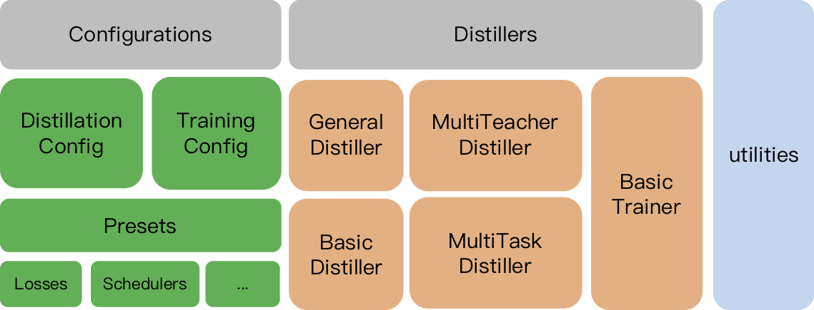
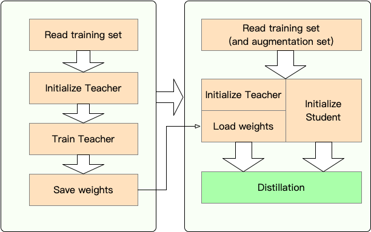

 [**English**](README.md) | [**中文说明**](README_ZH.md)

<p align="center">
    <br>
    
    <br>
<p>
<p align="center">
    <a href="https://github.com/airaria/TextBrewer/blob/master/LICENSE">
        
    </a>
    <a href="https://textbrewer.readthedocs.io/">
        
    </a>    
    <a href="https://pypi.org/project/textbrewer">
        
    </a>    
    <a href="https://github.com/airaria/TextBrewer/releases">
        
    </a>
</p>

**TextBrewer** is a PyTorch-based model distillation toolkit for natural language processing. It includes various distillation techniques from both NLP and CV field and provides an easy-to-use distillation framework, which allows users to quickly experiment with the state-of-the-art distillation methods to compress the model with a relatively small sacrifice in the performance, increasing the inference speed and reducing the memory usage.

Check our paper through [ACL Anthology](https://www.aclweb.org/anthology/2020.acl-demos.2/) or [arXiv pre-print](https://arxiv.org/abs/2002.12620).

[Full Documentation](https://textbrewer.readthedocs.io/)

## News

**Nov 11, 2020**

* **Updated to 0.2.1**:
  * **More flexible distillation**: Supports feeding different batches to the student and teacher. It means the batches for the student and teacher no longer need to be the same. It can be used for distilling models with different vocabularies (e.g., from RoBERTa to BERT).
  * **Faster distillation**: Users now can pre-compute and cache the teacher outputs, then feed the cache to the distiller to save teacher's forward pass time.
  
    See [Feed Different batches to Student and Teacher, Feed Cached Values](https://textbrewer.readthedocs.io/en/latest/Concepts.html#feed-different-batches-to-student-and-teacher-feed-cached-values) for details of the above features.
  
  * `MultiTaskDistiller` now supports intermediate feature matching loss.
  * Tensorboard now records more detailed losses (KD loss, hard label loss, matching losses...).

  See details in [releases](https://github.com/airaria/TextBrewer/releases/tag/v0.2.1).

**August 27, 2020**

**We are happy to announce that our model is on top of GLUE benchmark, check [leaderboard](https://gluebenchmark.com/leaderboard).**

<details>
<summary>Click here to see old news</summary>


**Aug 24, 2020**

* **Updated to 0.2.0.1**:
  * fixed bugs in `MultiTaskDistiller` and training loops.

**Jul 29, 2020**

* **Updated to 0.2.0**:
    * Added the support for distributed data-parallel training with `DistributedDataParallel`: `TrainingConfig` now accpects the `local_rank` argument. See the documentation of `TrainingConfig` for detail.
* Added an example of distillation on the Chinese NER task to demonstrate distributed data-parallel training. See [examples/msra_ner_example](examples/msra_ner_example).

**Jul 14, 2020**
* **Updated to 0.1.10**:
    * Now supports mixed precision training with Apex! Just set `fp16` to `True` in `TrainingConfig`. See the documentation of `TrainingConfig` for detail.
    * Added `data_parallel` option in `TrainingConfig` to enable data parallel training and mixed precision training work together.

**Apr 26, 2020**

* Added Chinese NER task (MSRA NER) results.
* Added results for distilling to T12-nano model, which has a similar strcuture to Electra-small.
* Updated some results of CoNLL-2003, CMRC 2018 and DRCD.

**Apr 22, 2020**

* **Updated to 0.1.9** (added cache option which speeds up distillation; fixed some bugs). See details in [releases](https://github.com/airaria/TextBrewer/releases/tag/v0.1.9).
* Added experimential results for distilling Electra-base to Electra-small on Chinese tasks.
* TextBrewer has been accepted by [ACL 2020](http://acl2020.org) as a demo paper, please use our new [bib entry](#Citation).

**Mar 17, 2020**

* Added CoNLL-2003 English NER distillation example. See [examples/conll2003_example](examples/conll2003_example).

**Mar 11, 2020**

* **Updated to 0.1.8** (Improvements on TrainingConfig and train method). See details in [releases](https://github.com/airaria/TextBrewer/releases/tag/v0.1.8).

**Mar 2, 2020**

* Initial public version 0.1.7 has been released. See details in [releases](https://github.com/airaria/TextBrewer/releases/tag/v0.1.7).

</details>

## Table of Contents

<!-- TOC -->

| Section | Contents |
|-|-|
| [Introduction](#introduction) | Introduction to TextBrewer |
| [Installation](#installation) | How to install |
| [Workflow](#workflow) | Two stages of TextBrewer workflow |
| [Quickstart](#quickstart) | Example: distilling BERT-base to a 3-layer BERT |
| [Experiments](#experiments) | Distillation experiments on typical English and Chinese datasets |
| [Core Concepts](#core-concepts) | Brief explanations of the core concepts in TextBrewer |
| [FAQ](#faq) | Frequently asked questions |
| [Known Issues](#known-issues) | Known issues |
| [Citation](#citation) | Citation to TextBrewer |
| [Follow Us](#follow-us) | - |

<!-- /TOC -->

## Introduction



**Textbrewer** is designed for the knowledge distillation of NLP models. It provides various distillation methods and offers a distillation framework for quickly setting up experiments. 

The main features of **TextBrewer** are:

* Wide-support: it supports various model architectures (especially **transformer**-based models)
* Flexibility: design your own distillation scheme by combining different techniques; it also supports user-defined loss functions, modules, etc.
* Easy-to-use: users don't need to modify the model architectures
* Built for NLP: it is suitable for a wide variety of NLP tasks: text classification, machine reading comprehension, sequence labeling, ...

**TextBrewer** currently is shipped with the following distillation techniques: 

* Mixed soft-label and hard-label training
* Dynamic loss weight adjustment and temperature adjustment
* Various distillation loss functions: hidden states MSE, attention-matrix-based loss, neuron selectivity transfer, ...
* Freely adding intermediate features matching losses
* Multi-teacher distillation
* ...

**TextBrewer** includes:

1. **Distillers**: the cores of distillation. Different distillers perform different distillation modes. There are GeneralDistiller, MultiTeacherDistiller, BasicTrainer, etc. 
2. **Configurations and presets**: Configuration classes for training and distillation, and predefined distillation loss functions and strategies. 
3. **Utilities**: auxiliary tools such as model parameters analysis. 


To start distillation, users need to provide

1. the models (the trained **teacher** model and the un-trained **student** model)
2. datasets and experiment configurations 

**TextBrewer** has achieved impressive results on several typical NLP tasks. See [Experiments](#experiments).

See [Full Documentation](https://textbrewer.readthedocs.io/) for detailed usages.

### Architecture


## Installation

* Requirements
  * Python >= 3.6
  * PyTorch >= 1.1.0
  * TensorboardX or Tensorboard
  * NumPy
  * tqdm
  * Transformers >= 2.0 (optional, used by some examples)
  * Apex == 0.1.0 (optional, mixed precision training)

* Install from PyPI

  ```shell
  pip install textbrewer
  ```

* Install from the Github source

  ```shell
  git clone https://github.com/airaria/TextBrewer.git
  pip install ./textbrewer
  ```

## Workflow




* **Stage 1**: Preparation:
  1. Train the teacher model
  2. Define and initialize the student model
  3. Construct a dataloader, an optimizer, and a learning rate scheduler

* **Stage 2**: Distillation with TextBrewer:
  1. Construct a **TraningConfig** and a **DistillationConfig**, initialize a **distiller**
  2. Define an **adaptor** and a **callback**. The **adaptor** is used for adaptation of model inputs and outputs. The **callback** is called by the distiller during training
  3. Call the **train** method of the **distiller**


## Quickstart

Here we show the usage of TextBrewer by distilling BERT-base to a 3-layer BERT.

Before distillation, we assume users have provided:

* A trained teacher model `teacher_model` (BERT-base) and a to-be-trained student model `student_model` (3-layer BERT).
* a `dataloader` of the dataset, an `optimizer` and a learning rate builder or class `scheduler_class ` and its args dict `scheduler_dict`.

Distill with TextBrewer:

```python 
import textbrewer
from textbrewer import GeneralDistiller
from textbrewer import TrainingConfig, DistillationConfig

# Show the statistics of model parameters
print("\nteacher_model's parametrers:")
result, _ = textbrewer.utils.display_parameters(teacher_model,max_level=3)
print (result)

print("student_model's parametrers:")
result, _ = textbrewer.utils.display_parameters(student_model,max_level=3)
print (result)

# Define an adaptor for interpreting the model inputs and outputs
def simple_adaptor(batch, model_outputs):
      # The second and third elements of model outputs are the logits and hidden states
    return {'logits': model_outputs[1],
            'hidden': model_outputs[2]}

# Training configuration 
train_config = TrainingConfig()
# Distillation configuration
# Matching different layers of the student and the teacher
distill_config = DistillationConfig(
    intermediate_matches=[    
     {'layer_T':0, 'layer_S':0, 'feature':'hidden', 'loss': 'hidden_mse','weight' : 1},
     {'layer_T':8, 'layer_S':2, 'feature':'hidden', 'loss': 'hidden_mse','weight' : 1}])

# Build distiller
distiller = GeneralDistiller(
    train_config=train_config, distill_config = distill_config,
    model_T = teacher_model, model_S = student_model, 
    adaptor_T = simple_adaptor, adaptor_S = simple_adaptor)

# Start!
with distiller:
    distiller.train(optimizer, dataloader, num_epochs=1, scheduler_class=scheduler_class, scheduler_args = scheduler_args, callback=None)
```

**Examples can be found in the `examples` directory :**

* [examples/random_token_example](examples/random_token_example) : a simple runable toy example which demonstrates the usage of TextBrewer. This example performs distillation on the text classification task with random tokens as inputs.
* [examples/cmrc2018\_example](examples/cmrc2018_example) (Chinese): distillation on CMRC 2018, a Chinese MRC task, using DRCD as data augmentation.
* [examples/mnli\_example](examples/mnli_example) (English): distillation on MNLI, an English sentence-pair classification task. This example also shows how to perform multi-teacher distillation.
* [examples/conll2003_example](examples/conll2003_example) (English): distillation on CoNLL-2003 English NER task, which is in form of sequence labeling.
* [examples/msra_ner_example](examples/msra_ner_example) (Chinese): This example distills a Chinese-ELECTRA-base model on the MSRA NER task with distributed data-parallel training(single node, muliti-GPU).


## Experiments

We have performed distillation experiments on several typical English and Chinese NLP datasets. The setups and configurations are listed below.

### Models

* For English tasks, the teacher model is [**BERT-base-cased**](https://github.com/google-research/bert).
* For Chinese tasks, the teacher models are [**RoBERTa-wwm-ext**](https://github.com/ymcui/Chinese-BERT-wwm) and [**Electra-base**](https://github.com/ymcui/Chinese-ELECTRA) released by the Joint Laboratory of HIT and iFLYTEK Research.

We have tested different student models. To compare with public results, the student models are built with standard transformer blocks except for BiGRU which is a single-layer bidirectional GRU. The architectures are listed below. Note that the number of parameters includes the embedding layer but does not include the output layer of each specific task. 

#### English models

| Model                 | \#Layers | Hidden size | Feed-forward size | \#Params | Relative size |
| :--------------------- | --------- | ----------- | ----------------- | -------- | ------------- |
| BERT-base-cased (teacher) | 12        | 768         | 3072              | 108M     | 100%          |
| T6 (student)              | 6         | 768         | 3072              | 65M      | 60%           |
| T3 (student)              | 3         | 768         | 3072              | 44M      | 41%           |
| T3-small (student)        | 3         | 384         | 1536              | 17M      | 16%           |
| T4-Tiny (student)         | 4         | 312         | 1200              | 14M      | 13%           |
| T12-nano (student)        | 12        | 256         | 1024              | 17M      | 16%           |
| BiGRU (student)           | -         | 768         | -                 | 31M      | 29%           |

#### Chinese models

| Model                 | \#Layers | Hidden size | Feed-forward size | \#Params | Relative size   |
| :--------------------- | --------- | ----------- | ----------------- | -------- | ------------- |
| RoBERTa-wwm-ext (teacher) | 12        | 768         | 3072              | 102M      | 100%          |
| Electra-base (teacher)    | 12        | 768         | 3072              | 102M      | 100%          |
| T3 (student)              | 3         | 768         | 3072              | 38M       | 37%           |
| T3-small (student)        | 3         | 384         | 1536              | 14M       | 14%           |
| T4-Tiny (student)         | 4         | 312         | 1200              | 11M       | 11%           |
| Electra-small (student)   | 12        | 256         | 1024              | 12M       | 12%           |

* T6 archtecture is the same as [DistilBERT<sup>[1]</sup>](https://arxiv.org/abs/1910.01108), [BERT<sub>6</sub>-PKD<sup>[2]</sup>](https://arxiv.org/abs/1908.09355), and  [BERT-of-Theseus<sup>[3]</sup>](https://arxiv.org/abs/2002.02925).
* T4-tiny archtecture is the same as [TinyBERT<sup>[4]</sup>](https://arxiv.org/abs/1909.10351).
* T3 architecure is the same as [BERT<sub>3</sub>-PKD<sup>[2]</sup>](https://arxiv.org/abs/1908.09355).

### Distillation Configurations

```python
distill_config = DistillationConfig(temperature = 8, intermediate_matches = matches)
# Others arguments take the default values
```

`matches` are differnt for different models:

| Model        | matches                                             |
| :--------    | --------------------------------------------------- |
| BiGRU        | None                                                |
| T6           | L6_hidden_mse + L6_hidden_smmd                      |
| T3           | L3_hidden_mse + L3_hidden_smmd                      |
| T3-small     | L3n_hidden_mse + L3_hidden_smmd                     |
| T4-Tiny      | L4t_hidden_mse + L4_hidden_smmd                     |
| T12-nano     | small_hidden_mse + small_hidden_smmd                |
| Electra-small| small_hidden_mse + small_hidden_smmd                |

The definitions of matches are at [examples/matches/matches.py](examples/matches/matches.py).

We use GeneralDistiller in all the distillation experiments.

### Training Configurations

* Learning rate is 1e-4 (unless otherwise specified).  
* We train all the models for 30~60 epochs.

### Results on English Datasets

We experiment on the following typical Enlgish datasets:

| Dataset    | Task type | Metrics | \#Train | \#Dev | Note |
| :---------- | -------- | ------- | ------- | ---- | ---- |
| [**MNLI**](https://www.nyu.edu/projects/bowman/multinli/)       | text classification | m/mm Acc | 393K    | 20K  | sentence-pair 3-class classification |
| [**SQuAD 1.1**](https://rajpurkar.github.io/SQuAD-explorer/)   | reading comprehension | EM/F1   | 88K     | 11K  | span-extraction machine reading comprehension |
| [**CoNLL-2003**](https://www.clips.uantwerpen.be/conll2003/ner) | sequence labeling | F1      | 23K     | 6K   | named entity recognition |

We list the public results from [DistilBERT](https://arxiv.org/abs/1910.01108), [BERT-PKD](https://arxiv.org/abs/1908.09355), [BERT-of-Theseus](https://arxiv.org/abs/2002.02925), [TinyBERT](https://arxiv.org/abs/1909.10351) and our results below for comparison.

Public results:

| Model (public) | MNLI  | SQuAD  | CoNLL-2003 |
| :-------------  | --------------- | ------------- | --------------- |
| DistilBERT (T6)    | 81.6 / 81.1 | 78.1 / 86.2   | -               |
| BERT<sub>6</sub>-PKD (T6)     | 81.5 / 81.0     | 77.1 / 85.3   | -|
| BERT-of-Theseus (T6) | 82.4/  82.1   | -        | -                |
| BERT<sub>3</sub>-PKD (T3)     | 76.7 / 76.3     | -             | -|
| TinyBERT (T4-tiny) | 82.8 / 82.9                | 72.7 / 82.1   | -|

Our results:

| Model (ours) | MNLI  | SQuAD  | CoNLL-2003 |
| :-------------  | --------------- | ------------- | --------------- |
| **BERT-base-cased** (teacher) | 83.7 / 84.0     | 81.5 / 88.6   | 91.1  |
| BiGRU          | -               | -             | 85.3            |
| T6             | 83.5 / 84.0     | 80.8 / 88.1   | 90.7            |
| T3             | 81.8 / 82.7     | 76.4 / 84.9   | 87.5            |
| T3-small       | 81.3 / 81.7     | 72.3 / 81.4   | 78.6            |
| T4-tiny        | 82.0 / 82.6     | 75.2 / 84.0   | 89.1            |
| T12-nano       | 83.2 / 83.9     | 79.0 / 86.6   | 89.6            |

**Note**:

1. The equivalent model structures of public models are shown in the brackets after their names. 
2. When distilling to T4-tiny, NewsQA is used for data augmentation on SQuAD and HotpotQA is used for data augmentation on CoNLL-2003.
3. When distilling to T12-nano, HotpotQA is used for data augmentation on CoNLL-2003.


### Results on Chinese Datasets

We experiment on the following typical Chinese datasets:


| Dataset | Task type | Metrics | \#Train | \#Dev | Note |
| :------- | ---- | ------- | ------- | ---- | ---- |
| [**XNLI**](https://github.com/google-research/bert/blob/master/multilingual.md) | text classification | Acc | 393K | 2.5K | Chinese translation version of MNLI |
| [**LCQMC**](http://icrc.hitsz.edu.cn/info/1037/1146.htm) | text classification | Acc | 239K | 8.8K | sentence-pair matching, binary classification |
| [**CMRC 2018**](https://github.com/ymcui/cmrc2018) | reading comprehension | EM/F1 | 10K | 3.4K | span-extraction machine reading comprehension |
| [**DRCD**](https://github.com/DRCKnowledgeTeam/DRCD) | reading comprehension | EM/F1 | 27K | 3.5K | span-extraction machine reading comprehension (Traditional Chinese) |
| [**MSRA NER**](https://faculty.washington.edu/levow/papers/sighan06.pdf) | sequence labeling | F1 | 45K | 3.4K (#Test) | Chinese named entity recognition |

The results are listed below.

| Model           | XNLI | LCQMC | CMRC 2018 | DRCD |
| :--------------- | ---------- | ----------- | ---------------- | ------------ |
| **RoBERTa-wwm-ext** (teacher) | 79.9       | 89.4        | 68.8 / 86.4      | 86.5 / 92.5  |
| T3          | 78.4       | 89.0        | 66.4 / 84.2      | 78.2 / 86.4  |
| T3-small    | 76.0       | 88.1        | 58.0 / 79.3      | 75.8 / 84.8  |
| T4-tiny     | 76.2       | 88.4        | 61.8 / 81.8      | 77.3 / 86.1  |

| Model                       | XNLI       | LCQMC       | CMRC 2018        | DRCD        | MSRA NER |
| :---------------------------| ---------- | ----------- | ---------------- | ------------|----------|
| **Electra-base** (teacher)) | 77.8       | 89.8        | 65.6 / 84.7     | 86.9 / 92.3  | 95.14    |
| Electra-small               | 77.7       | 89.3        | 66.5 / 84.9     | 85.5 / 91.3  | 93.48    |


**Note**:

1. Learning rate decay is not used in distillation on CMRC 2018 and DRCD.
2. CMRC 2018 and DRCD take each other as the augmentation dataset in the distillation.
3. The settings of training Electra-base teacher model can be found at [**Chinese-ELECTRA**](https://github.com/ymcui/Chinese-ELECTRA).
4. Electra-small student model is intialized with the [pretrained weights](https://github.com/ymcui/Chinese-ELECTRA).

## Core Concepts

### Configurations

* `TrainingConfig`: configuration related to general deep learning model training
* `DistillationConfig`: configuration related to distillation methods

### Distillers

Distillers are in charge of conducting the actual experiments. The following distillers are available:

* `BasicDistiller`: **single-teacher single-task** distillation, provides basic distillation strategies.
* `GeneralDistiller` (Recommended): **single-teacher single-task** distillation, supports intermediate features matching. **Recommended most of the time**.
* `MultiTeacherDistiller`: **multi-teacher** distillation, which distills multiple teacher models (of the same task) into a single student model. **This class doesn't support Intermediate features matching.**
* `MultiTaskDistiller`: **multi-task** distillation, which distills multiple teacher models (of different tasks) into a single student.
* `BasicTrainer`: Supervised training a single model on a labeled dataset, not for distillation. **It can be used to train a teacher model**.


### User-Defined Functions

In TextBrewer, there are two functions that should be implemented by users: **callback** and **adaptor**.

####  **Callback** 

At each checkpoint, after saving the student model, the callback function will be called by the distiller. A callback can be used to evaluate the performance of the student model at each checkpoint.

#### Adaptor
It converts the model inputs and outputs to the specified format so that they could be recognized by the distiller, and distillation losses can be computed. At each training step, batch and model outputs will be passed to the adaptor; the adaptor re-organizes the data and returns a dictionary.

For more details, see the explanations in [Full Documentation](https://textbrewer.readthedocs.io/).

## FAQ

**Q**: How to initialize the student model?

**A**: The student model could be randomly initialized (i.e., with no prior knowledge) or be initialized by pre-trained weights.
For example, when distilling a BERT-base model to a 3-layer BERT, you could initialize the student model with [RBT3](#https://github.com/ymcui/Chinese-BERT-wwm) (for Chinese tasks) or the first three layers of BERT (for English tasks) to avoid cold start problem. 
We recommend that users use pre-trained student models whenever possible to fully take advantage of large-scale pre-training.

**Q**: How to set training hyperparameters for the distillation experiments？

**A**: Knowledge distillation usually requires more training epochs and larger learning rate than training on the labeled dataset. For example, training SQuAD on BERT-base usually takes 3 epochs with lr=3e-5; however, distillation takes 30~50 epochs with lr=1e-4. **The conclusions are based on our experiments, and you are advised to try on your own data**.

**Q**: My teacher model and student model take different inputs (they do not share vocabularies), so how can I distill?

**A**: You need to feed different batches to the teacher and the student. See the section [Feed Different batches to Student and Teacher, Feed Cached Values](https://textbrewer.readthedocs.io/en/latest/Concepts.html#feed-different-batches-to-student-and-teacher-feed-cached-values) in the full documentation.

**Q**: I have stored the logits from my teacher model. Can I use them in the distillation to save the forward pass time?

**A**: Yes, see the section [Feed Different batches to Student and Teacher, Feed Cached Values](https://textbrewer.readthedocs.io/en/latest/Concepts.html#feed-different-batches-to-student-and-teacher-feed-cached-values) in the full documentation.

## Known Issues

* ~~Multi-GPU training support is only available through `DataParallel` currently.~~
* Multi-label classification is not supported.

## Citation

If you find TextBrewer is helpful, please cite [our paper](https://www.aclweb.org/anthology/2020.acl-demos.2/):
```bibtex
@InProceedings{textbrewer-acl2020-demo,
    title = "{T}ext{B}rewer: {A}n {O}pen-{S}ource {K}nowledge {D}istillation {T}oolkit for {N}atural {L}anguage {P}rocessing",
    author = "Yang, Ziqing and Cui, Yiming and Chen, Zhipeng and Che, Wanxiang and Liu, Ting and Wang, Shijin and Hu, Guoping",
    booktitle = "Proceedings of the 58th Annual Meeting of the Association for Computational Linguistics: System Demonstrations",
    year = "2020",
    publisher = "Association for Computational Linguistics",
    url = "https://www.aclweb.org/anthology/2020.acl-demos.2",
    pages = "9--16",
}
```

## Follow Us
Follow our official WeChat account to keep updated with our latest technologies!


