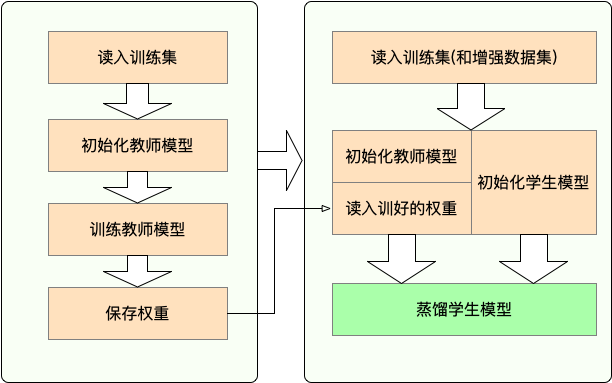

 [**English**](README.md) | [**中文说明**](README_ZH.md)

<p align="center">
    <br>
    
    <br>
<p>
<p align="center">
    <a href="https://github.com/airaria/TextBrewer/blob/master/LICENSE">
        
    </a>
    <a href="https://pypi.org/project/textbrewer">
        
    </a>    
    <a href="https://github.com/airaria/TextBrewer/releases">
        
    </a>
</p>

**TextBrewer**是一个基于PyTorch的、为实现NLP中的**知识蒸馏**任务而设计的工具包，
融合并改进了NLP和CV中的多种知识蒸馏技术，提供便捷快速的知识蒸馏框架，
用于以较低的性能损失压缩神经网络模型的大小，提升模型的推理速度，减少内存占用。

Paper: [https://arxiv.org/abs/2002.12620](https://arxiv.org/abs/2002.12620)

[API文档](API_ZH.md)

## 更新

**Mar 17, 2020**

* examples中添加了CoNLL-2003英文NER任务上的蒸馏的示例代码，见 [examples/conll2003_example](examples/conll2003_example)。

**Mar 11, 2020**

* **版本更新至 0.1.8**（改进了`TrainingConfig`和distiller的`train`方法），细节参见 [releases](https://github.com/airaria/TextBrewer/releases/tag/v0.1.8)。

**Mar 2, 2020**

* **当前版本**: 0.1.7, 初始版本。

## 目录

<!-- TOC -->

| 章节 | 内容 |
|-|-|
| [简介](#简介) | TextBrewer简介 |
| [安装](#安装) | 安装方法介绍 |
| [工作流程](#工作流程) | TextBrewer整体工作流程 |
| [快速开始](#快速开始) | 举例展示TextBrewer用法：BERT-base蒸馏至3层BERT |
| [蒸馏效果](#蒸馏效果) | 中文、英文典型数据集上的蒸馏效果展示 |
| [核心概念](#核心概念) | TextBrewer中的核心概念介绍 |
| [FAQ](#faq) | 常见问题解答 |
| [引用](#引用) | TextBrewer参考引用 |
| [已知问题](#已知问题) | 尚未解决的问题 |
| [关注我们](#关注我们) | - |

<!-- /TOC -->

## 简介

**TextBrewer** 为NLP中的知识蒸馏任务设计，融合了多种知识蒸馏技术，提供方便快捷的知识蒸馏框架。

主要特点：

* 模型无关：适用于多种模型结构（主要面向**Transfomer**结构）
* 方便灵活：可自由组合多种蒸馏方法；可方便增加自定义损失等模块
* 非侵入式：无需对教师与学生模型本身结构进行修改
* 支持典型的NLP任务：文本分类、阅读理解、序列标注等

**TextBrewer**目前支持的知识蒸馏技术有：

* 软标签与硬标签混合训练
* 动态损失权重调整与蒸馏温度调整
* 多种蒸馏损失函数: hidden states MSE, attention-based loss, neuron selectivity transfer, ...
* 任意构建中间层特征匹配方案
* 多教师知识蒸馏
* ...

**TextBrewer**的主要功能与模块分为3块：

1. **Distillers**：进行蒸馏的核心部件，不同的distiller提供不同的蒸馏模式。目前包含GeneralDistiller, MultiTeacherDistiller, MultiTaskDistiller等
2. **Configurations and Presets**：训练与蒸馏方法的配置，并提供预定义的蒸馏策略以及多种知识蒸馏损失函数
3. **Utilities**：模型参数分析显示等辅助工具

用户需要准备：

1. 已训练好的**教师**模型, 待蒸馏的**学生**模型
2. 训练数据与必要的实验配置， 即可开始蒸馏

在多个典型NLP任务上，TextBrewer都能取得较好的压缩效果。相关实验见[蒸馏效果](#蒸馏效果)。

详细的API可参见[API文档](API_ZH.md)。

## 安装

### 安装要求

* Python >= 3.6
* PyTorch >= 1.1.0
* TensorboardX or Tensorboard
* NumPy
* tqdm
* Transformers >= 2.0 (可选, Transformer相关示例需要用到)

### 安装方式

* 从PyPI自动下载安装包安装:

```shell
pip install textbrewer
```

* 从源码文件夹安装:

```shell
git clone https://github.com/airaria/TextBrewer.git
pip install ./textbrewer
```

## 工作流程



* **Stage 1 :** 蒸馏之前的准备工作:
  1. 训练**教师**模型
  2. 定义与初始化**学生**模型（随机初始化，或载入预训练权重）
  3. 构造蒸馏用数据集的dataloader，训练**学生**模型用的optimizer和learning rate scheduler
  
* **Stage 2 :** 使用TextBrewer蒸馏：
  1. 构造训练配置(`TrainingConfig`)和蒸馏配置(`DistillationConfig`),初始化**distiller**
  2. 定义**adaptor** 和 **callback** ，分别用于适配模型输入输出和训练过程中的回调
  3. 调用**distiller**的**train**方法开始蒸馏


## 快速开始

以蒸馏BERT-base到3层BERT为例展示TextBrewer用法。

在开始蒸馏之前准备：

- 训练好的教师模型`teacher_model` (BERT-base)，待训练学生模型`student_model` (3-layer BERT)
- 数据集`dataloader`，优化器`optimizer`，学习率调节器`scheduler`

使用TextBrewer蒸馏:

```python
import textbrewer
from textbrewer import GeneralDistiller
from textbrewer import TrainingConfig, DistillationConfig

# 展示模型参数量的统计
print("\nteacher_model's parametrers:")
_ = textbrewer.utils.display_parameters(teacher_model,max_level=3)

print("student_model's parametrers:")
_ = textbrewer.utils.display_parameters(student_model,max_level=3)

# 定义adaptor用于解释模型的输出
def simple_adaptor(batch, model_outputs):
    # model输出的第二、三个元素分别是logits和hidden states
    return {'logits': model_outputs[1], 'hidden': model_outputs[2]}

# 蒸馏与训练配置
# 匹配教师和学生的embedding层；同时匹配教师的第8层和学生的第2层
distill_config = DistillationConfig(
    intermediate_matches=[    
     {'layer_T':0, 'layer_S':0, 'feature':'hidden', 'loss': 'hidden_mse','weight' : 1},
     {'layer_T':8, 'layer_S':2, 'feature':'hidden', 'loss': 'hidden_mse','weight' : 1}])
train_config = TrainingConfig()

#初始化distiller
distiller = GeneralDistiller(
    train_config=train_config, distill_config = distill_config,
    model_T = teacher_model, model_S = student_model, 
    adaptor_T = simple_adaptor, adaptor_S = simple_adaptor)

# 开始蒸馏
with distiller:
    distiller.train(optimizer, scheduler, dataloader, num_epochs=1, callback=None)
```

**更多的示例可参见`examples`文件夹：**

* [examples/random_token_example](examples/random_token_example): 一个可运行的简单示例，在文本分类任务上以随机文本为输入，演示TextBrewer用法。
* [examples/cmrc2018\_example](examples/cmrc2018_example) (中文): CMRC2018上的中文阅读理解任务蒸馏，并使用DRCD数据集做数据增强。
* [examples/mnli\_example](examples/mnli_example) (英文): MNLI任务上的英文句对分类任务蒸馏，并展示如何使用多教师蒸馏。
* [examples/conll2003_example](examples/conll2003_example) (英文): CoNLL-2003英文实体识别任务上的序列标注任务蒸馏。

## 蒸馏效果

我们在多个中英文文本分类、阅读理解、序列标注数据集上进行了蒸馏实验。实验的配置和效果如下。

### 模型

* 对于英文任务，教师模型为[**BERT-base-cased**](https://github.com/google-research/bert)
* 对于中文任务，教师模型为HFL发布的[**RoBERTa-wwm-ext**](https://github.com/ymcui/Chinese-BERT-wwm)

我们测试了不同的学生模型，为了与已有公开结果相比较，除了BiGRU都是和BERT一样的多层Transformer结构。模型的参数如下表所示。需要注意的是，参数量的统计包括了embedding层，但不包括最终适配各个任务的输出层。

| Model                 | \#Layers | Hidden size | Feed-forward size | \#Params | Relative size |
| :--------------------- | --------- | ----------- | ----------------- | -------- | ------------- |
| BERT-base-cased (教师) | 12        | 768         | 3072              | 108M     | 100%          |
| RoBERTa-wwm-ext (教师) | 12        | 768         | 3072              | 108M     | 100%          |
| T6 (学生)  | 6         | 768         | 3072              | 65M      | 60%           |
| T3 (学生)            | 3         | 768         | 3072              | 44M      | 41%           |
| T3-small (学生)        | 3         | 384         | 1536              | 17M      | 16%           |
| T4-Tiny (学生)  | 4         | 312         | 1200              | 14M      | 13%           |
| BiGRU (学生)           | -         | 768         | -                 | 31M      | 29%           |

* T6的结构与[DistilBERT<sup>[1]</sup>](https://arxiv.org/abs/1910.01108), [BERT<sub>6</sub>-PKD<sup>[2]</sup>](https://arxiv.org/abs/1908.09355), [BERT-of-Theseus<sup>[3]</sup>](https://arxiv.org/abs/2002.02925) 相同。
* T4-tiny的结构与 [TinyBERT<sup>[4]</sup>](https://arxiv.org/abs/1909.10351) 相同。
* T3的结构与[BERT<sub>3</sub>-PKD<sup>[2]</sup>](https://arxiv.org/abs/1908.09355) 相同。

#### 蒸馏配置

```python
distill_config = DistillationConfig(temperature = 8, intermediate_matches = matches)
# 其他参数为默认值
```

不同的模型用的`matches`我们采用了以下配置：

| Model    | matches                                                      |
| :-------- | ------------------------------------------------------------ |
| BiGRU    | None                                                         |
| T6       | L6_hidden_mse + L6_hidden_smmd                               |
| T3       | L3_hidden_mse + L3_hidden_smmd                               |
| T3-small | L3n_hidden_mse + L3_hidden_smmd                              |
| T4-Tiny  | L4t_hidden_mse + L4_hidden_smmd                              |

各种matches的定义在[exmaple/matches/matches.py](exmaple/matches/matches.py)文件中。均使用GeneralDistiller进行蒸馏。

#### 训练配置

蒸馏用的学习率 lr=1e-4(除非特殊说明)。训练30\~60轮。

### 英文实验结果

在英文实验中，我们使用了如下三个典型数据集。

| Dataset    | Task type | Metrics | \#Train | \#Dev | Note |
| :---------- | -------- | ------- | ------- | ---- | ---- | 
| [**MNLI**](https://www.nyu.edu/projects/bowman/multinli/)       | 文本分类 | m/mm Acc | 393K    | 20K  | 句对三分类任务 |
| [**SQuAD 1.1**](https://rajpurkar.github.io/SQuAD-explorer/)   | 阅读理解 | EM/F1   | 88K     | 11K  | 篇章片段抽取型阅读理解 | 
| [**CoNLL-2003**](https://www.clips.uantwerpen.be/conll2003/ner) | 序列标注 | F1      | 23K     | 6K   | 命名实体识别任务 |

我们在下面两表中列出了[DistilBERT](https://arxiv.org/abs/1910.01108), [BERT-PKD](https://arxiv.org/abs/1908.09355), [BERT-of-Theseus](https://arxiv.org/abs/2002.02925), [TinyBERT](https://arxiv.org/abs/1909.10351) 等公开的蒸馏结果，并与我们的结果做对比。

Public results:

  | Model (public) | MNLI | SQuAD | CoNLL-2003 |
  | :-------------  | --------------- | ------------- | --------------- |
  | DistilBERT (T6)    | 81.6 / 81.1 | 78.1 / 86.2   | -               |
  | BERT<sub>6</sub>-PKD (T6)     | 81.5 / 81.0     | 77.1 / 85.3   | -|
  | BERT-of-Theseus (T6) | 82.4/  82.1   | -        | -                |
  | BERT<sub>3</sub>-PKD (T3)     | 76.7 / 76.3     | -             | -|
  | TinyBERT (T4-tiny) | 82.8 / 82.9                | 72.7 / 82.1   | -|

Our results:

| Model (ours) | MNLI | SQuAD | CoNLL-2003 |
| :-------------  | --------------- | ------------- | --------------- |
| **BERT-base-cased**  | 83.7 / 84.0     | 81.5 / 88.6   | 91.1  |
| BiGRU          | -               | -             | 85.3            |
| T6             | 83.5 / 84.0     | 80.8 / 88.1   | 90.7            |
| T3             | 81.8 / 82.7     | 76.4 / 84.9   | 87.5            |
| T3-small       | 81.3 / 81.7     | 72.3 / 81.4   | 57.4            |
| T4-tiny        | 82.0 / 82.6     | 75.2 / 84.0   | 79.6            |

说明：

1. 公开模型的名称后括号内是其等价的模型结构
2. 蒸馏到T4-tiny的实验中，SQuAD任务上用的是NewsQA作为增强数据；CoNLL-2003上用的是HotpotQA的篇章作为增强数据


### 中文实验结果

在中文实验中，我们使用了如下四个典型数据集。

| Dataset | Task type | Metrics | \#Train | \#Dev | Note |
| :------- | ---- | ------- | ------- | ---- | ---- |
| [**XNLI**](https://github.com/google-research/bert/blob/master/multilingual.md) | 文本分类 | Acc | 393K | 2.5K | MNLI的中文翻译版本，3分类任务 |
| [**LCQMC**](http://icrc.hitsz.edu.cn/info/1037/1146.htm) | 文本分类 | Acc | 239K | 8.8K | 句对二分类任务，判断两个句子的语义是否相同 |
| [**CMRC 2018**](https://github.com/ymcui/cmrc2018) | 阅读理解 | EM/F1 | 10K | 3.4K | 篇章片段抽取型阅读理解 |
| [**DRCD**](https://github.com/DRCKnowledgeTeam/DRCD) | 阅读理解 | EM/F1 | 27K | 3.5K | 繁体中文篇章片段抽取型阅读理解 |

实验结果如下表所示。

| Model           | XNLI | LCQMC | CMRC 2018 | DRCD |
| :--------------- | ---------- | ----------- | ---------------- | ------------ |
| **RoBERTa-wwm-ext** | 79.9       | 89.4        | 68.8 / 86.4      | 86.5 / 92.5  |
| T3          | 78.4       | 89.0        | 66.4 / 84.2      | 78.2 / 86.4  |
| T3-small    | 76.0       | 88.1        | 58.0 / 79.3      | 65.5 / 78.6  |
| T4-tiny     | 76.2       | 88.4        | 61.8 / 81.8      | 73.3 / 83.5  |

说明：

1. 蒸馏CMRC2018和DRCD上时学习率分别为1.5e-4和7e-5，并且不采用学习率衰减
2. CMRC2018和DRCD两个任务上他们互作为增强数据


## 核心概念

### Configurations

* `TrainingConfig` 和 `DistillationConfig`：训练和蒸馏相关的配置。

### Distillers

Distiller负责执行实际的蒸馏过程。目前实现了以下的distillers:

* `BasicDistiller`: 提供**单模型单任务**蒸馏方式。可用作测试或简单实验。
* `GeneralDistiller` (常用): 提供**单模型单任务**蒸馏方式，并且支持**中间层特征匹配**，一般情况下**推荐使用**。
* `MultiTeacherDistiller`: 多教师蒸馏。将多个（同任务）教师模型蒸馏到一个学生模型上。**暂不支持中间层特征匹配**。
* `MultiTaskDistiller`：多任务蒸馏。将多个（不同任务）单任务教师模型蒸馏到一个多任务学生模型上。**暂不支持中间层特征匹配**。
* `BasicTrainer`：用于单个模型的有监督训练，而非蒸馏。**可用于训练教师模型**。

### 用户定义函数

蒸馏实验中，有两个组件需要由用户提供，分别是**callback** 和 **adaptor** :

#### Callback

回调函数。在每个checkpoint，保存模型后会被`distiller`调用，并传入当前模型。可以借由回调函数在每个checkpoint评测模型效果。

#### Adaptor

将模型的输入和输出转换为指定的格式，向`distiller`解释模型的输入和输出，以便`distiller`根据不同的策略进行不同的计算。在每个训练步，`batch`和模型的输出`model_outputs`会作为参数传递给`adaptor`，`adaptor`负责重新组织这些数据，返回一个字典。

更多细节可参见[API文档](API.md)中的说明。

## FAQ

**Q**: 学生模型该如何初始化？

**A**: 知识蒸馏本质上是“老师教学生”的过程。在初始化学生模型时，可以采用随机初始化的形式（即完全不包含任何先验知识），也可以载入已训练好的模型权重。例如，从BERT-base模型蒸馏到3层BERT时，可以预先载入[RBT3](#https://github.com/ymcui/Chinese-BERT-wwm)模型权重(中文任务)或BERT的前三层权重(英文任务)，然后进一步进行蒸馏，避免了蒸馏过程的“冷启动”问题。我们建议用户在使用时尽量采用已预训练过的学生模型，以充分利用大规模数据预训练所带来的优势。

**Q**: 如何设置蒸馏的训练参数以达到一个较好的效果？

**A**: 知识蒸馏的比有标签数据上的训练需要更多的训练轮数与更大的学习率。比如，BERT-base上训练SQuAD一般以lr=3e-5训练3轮左右即可达到较好的效果；而蒸馏时需要以lr=1e-4训练30~50轮。当然具体到各个任务上肯定还有区别，**我们的建议仅是基于我们的经验得出的，仅供参考**。

## 已知问题

* FP16精度训练的兼容性尚未测试。
* 尚不支持DataParallel以外的多卡训练策略。

## 引用

如果TextBrewer工具包对你的研究工作有所帮助，请在文献中引用下述[技术报告](https://arxiv.org/abs/2002.12620)：

```
 @article{textbrewer,
   title={TextBrewer: An Open-Source Knowledge Distillation Toolkit for Natural Language Processing},
   author={Yang, Ziqing and Cui, Yiming and Chen, Zhipeng and Che, Wanxiang and Liu, Ting and Wang, Shijin and Hu, Guoping},
   journal={arXiv preprint arXiv:2002.2002.12620},
   year={2020}
  }
 ```

## 关注我们

欢迎关注哈工大讯飞联合实验室官方微信公众号，了解最新的技术动态。


